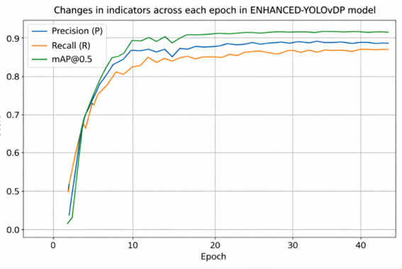
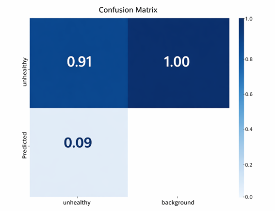
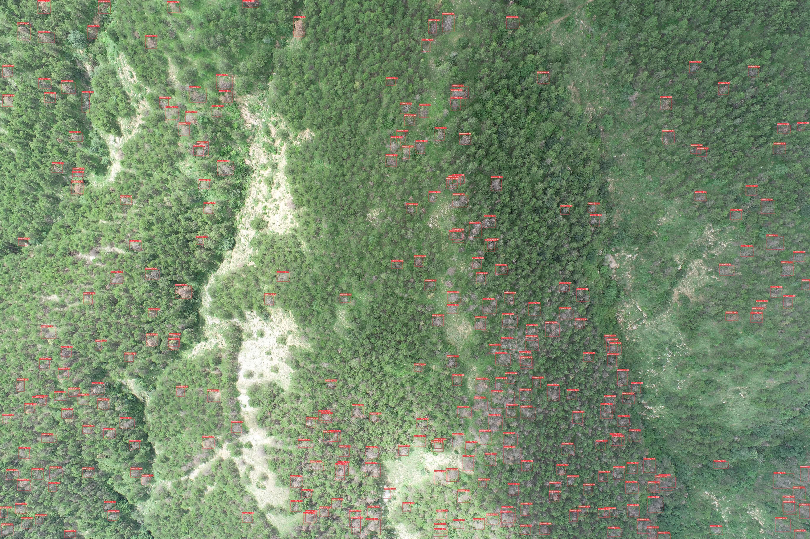
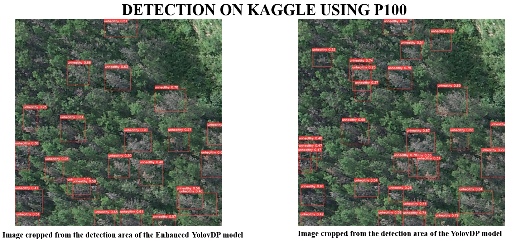

# ENHANCED-YOLOvDP: A LIGHTWEIGHT REAL-TIME DETECTION MODEL FOR UAV-BASED PLANT DISEASE MONITORING ON EDGE PLATFORMS

## OVERVIEW

This repository introduces an enhanced computing framework built upon the **YOLOvDP** architecture, originally proposed in the paper *"PDT: Uav Target Detection Dataset for Pests and Diseases Tree"* (Mingle Zhou, Rui Xing, Delong Han, Zhiyong Qi, Gang Li* - **ECCV 2024**). 

While the baseline YOLOvDP model provides robust accuracy, deploying it in practical scenarios introduces severe bottlenecks. This project bridges that gap by implementing targeted optimizations to address three critical challenges in modern aerial edge computing:

1. **Inference Speed Acceleration (FPS Upgrade):** Redesigning computational layers and optimizing the processing pipeline to eliminate latency, enabling real-time detection performance.
2. **Edge Device Deployability:** Optimizing the computational graph and applying model compression techniques (such as quantization and runtime conversion) to ensure smooth, high-speed execution directly on low-power edge hardware.
3. **High-Density Large Scale Detection:** Enhancing the feature extraction network to effectively detect dense, overlapping infected trees from high-resolution UAV forest imagery, preventing miss-detections in complex canopy structures.

## DATASET
This project utilizes the **PDT Dataset** obtained from the official repository: [ruixing123/pdt_cwc_yolo-dp](https://github.com/ruixing123/pdt_cwc_yolo-dp). 

The dataset consists of high-resolution aerial imagery captured by Unmanned Aerial Vehicles (UAVs) over a pine forest, specifically designed for evaluating object detection models in complex forestry scenarios.

### Dataset Characteristics & Specifications

* **Class Focus:** `Unhealthy` (Targeting infected or damaged pine trees within the forest canopy).

  
   

* **Double Resolution Framework:** To optimize the model for multi-scale feature learning, the dataset is structured into two resolution tiers:
  * **LH (High Resolution):** Contains the original, full-scale raw images captured directly by the UAV.
  * **LL (Low Resolution):** Contains sub-images cropped into $640 \times 640$ patches using a **sliding window technique**, preserving local small-target details for dense detection without overloading edge memory.

  
   

### Dataset Structure:

| Metric | Total Images | Train | Test | Validation |
| --- | --- | --- | --- | --- |
| **Number of Images Used** | 5,670 | 4,536 | 567 | 567 |
| **Percentage** | 100% | 80% | 10% | 10% |

## CODE

Since the entire workflow (data preparation, architectural modifications, training, and FPS benchmarking) was executed in the **Kaggle** cloud environment, you can easily reproduce our results using the provided Jupyter Notebook.

### 🏃‍♂️ Running on Kaggle

1. **Open Notebook:** Navigate to the [`notebooks/`](notebooks/) directory and open [`enhanced-yolovdp-fps-upgrade.ipynb`](notebooks/enhanced-yolovdp-fps-upgrade.ipynb).
2. **Import to Kaggle:** 
   * Go to [Kaggle Notebooks](https://www.kaggle.com/code) $\rightarrow$ **New Notebook**.
   * Click **File** $\rightarrow$ **Import Notebook** and upload `enhanced-yolovdp-fps-upgrade.ipynb`.
3. **Accelerator Setup:**
   * In the right panel, set **Accelerator** to **GPU P100** (or T4 x2).
4. **Attach Dataset:**
   * Add the PDT dataset (`ruixing123/pdt_cwc_yolo-dp`) to the notebook environment.
5. **Execute:** Run all cells sequentially to start model training for 50 epochs and compute inference metrics.

## MODEL ARCHITECTURE

  
   

* **Backbone:** Replaced heavy **LSK modules** with standard **C3 blocks** to reduce parameters and computational burden.
* **Neck:** Removed the **P3 feature fusion branch** (upsampling, concatenation, and convolutions) to slash latency and boost FPS.

## EXPERIMENT

### 🧪 Experimental Setup & Results
* **Platform:** Kaggle Notebooks
* **GPU:** NVIDIA Tesla P100 (16GB VRAM)
* **Framework:** PyTorch >= 1.13.0, Python 3.10+
* **Epochs:** 50
* **Batch Size:** 16 
* **Image Size:** 640

  
   

  
   

### 📊 Performance Comparison

| Model | Precision (P) | Recall (R) | F1 Score | mAP@.5 | mAP@.5:.95 | Parameters | GFLOPs | FPS |
| :--- | :---: | :---: | :---: | :---: | :---: | :---: | :---: | :---: |
| **YOLOvDP-Enhanced (Our)** | **0.887** | **0.831** | **0.858** | **0.901** | **0.603** | **6,099,030** | **12.8** | **116.28** |
| YOLOv5s | 0.877 | 0.815 | 0.845 | 0.882 | 0.605 | 7,012,822 | 15.8 | 81.97 |
| YOLOv5n | 0.873 | 0.808 | 0.839 | 0.880 | 0.588 | 1,760,518 | 4.1 | 80.00 |
| YOLOv8n | 0.8721 | 0.8455 | 0.8586 | 0.9247 | 0.6396 | 3,011,043 | 8.1942 | 78.465 |
| YOLOv11n | 0.875 | 0.8403 | 0.8573 | 0.9234 | 0.6394 | 2,590,035 | 6.4406 | 67.982 |
| YOLOv-DP | 0.862 | 0.794 | 0.827 | 0.863 | 0.571 | 4,993,774 | 11.1 | 51.02 |

## VISUALIZATION RESEARCH

* **Full-Resolution Detection:** Detection results on large-scale, high-resolution (LH) aerial imagery.

  
   

* **Cropped Region Comparison:** Visual comparison between **YOLOv-DP** and **YOLOvDP-Enhanced (Our)** on cropped local patches from LH images.

  
   

### 🚀 Happy Detecting & Keep Researching!

Thanks for checking out our project! If this repository helps you boost your model's FPS, advance your thesis, or make your agricultural UAV applications run smoother, our job here is done. 

Feel free to contribute, report issues, or give this repo a ⭐ if you found it helpful! 😊

## PAPER

> 📄 **Our Publication:** For detailed methodology, architectural proofs, and comprehensive experimental results, please refer to our full paper located at [`documents/paper.pdf`](documents/paper.pdf).

1. **V. H. Khang et al.**, "Enhanced-YOLOvDP: Lightweight and High-FPS Object Detection Model for Agricultural UAV Applications," *Project Paper/Documentation*, 2026. *(See `documents/paper.pdf`)*
2. M. Zhou, R. Xing, D. Han, Z. Qi, and G. Li, "PDT: UAV Target Detection Dataset for Pests and Diseases," 2024.
3. R. Agarwal, S. Hariharan, M. N. Rao, and A. Agarwal, "Weed identification using k means clustering with color spaces features in multi-spectral images taken by UAV," in *IEEE International Geoscience and Remote Sensing Symposium (IGARSS)*, 2021, pp. 7047–7050.
4. A. Hendrawan, R. Gernowo, O. D. Nurhayati, B. Warsito, and A. Wibowo, "Improvement Object Detection Algorithm Based on YoloV5 with BottleneckCSP," *IEEE*, 2022.
5. T. Kvietkauskas, E. Pavlov, P. Stefanovic, and B. Pliuskuviene, "The Efficiency of YOLOv5 Models in the Detection of Similar Construction Details," Apr. 2024.
6. Zunin, "Intel OpenVINO Toolkit for Computer Vision: Object Detection and Semantic Segmentation," *IEEE*, 2021.
7. Ultralytics, "Intel OpenVINO Export Integration," *Ultralytics Docs*. Available: https://docs.ultralytics.com/integrations/openvino/ (Accessed: Jan. 20, 2026).
8. Ultralytics, "Ultralytics YOLO11 Documentation," *Ultralytics Docs*. Available: https://docs.ultralytics.com/models/yolo11/ (Accessed: Jan. 20, 2026).
9. LogicTronix, "YOLOv5 Quantization & Compilation with Vitis AI 3.0 for Kria KV260," *Hackster.io*. Available: https://www.hackster.io/LogicTronix/yolov5-quantization-compilation-with-vitis-ai-3-0-for-kria-7b005d (Accessed: Jan. 20, 2026).
6. Ultralytics, "Intel OpenVINO Export Integration," *Ultralytics Docs*. Available: https://docs.ultralytics.com/integrations/openvino/ (Accessed: Jan. 20, 2026).
7. Ultralytics, "Ultralytics YOLO11 Documentation," *Ultralytics Docs*. Available: https://docs.ultralytics.com/models/yolo11/ (Accessed: Jan. 20, 2026).
8. LogicTronix, "YOLOv5 Quantization & Compilation with Vitis AI 3.0 for Kria KV260," *Hackster.io*. Available: https://www.hackster.io/LogicTronix/yolov5-quantization-compilation-with-vitis-ai-3-0-for-kria-7b005d (Accessed: Jan. 20, 2026).

